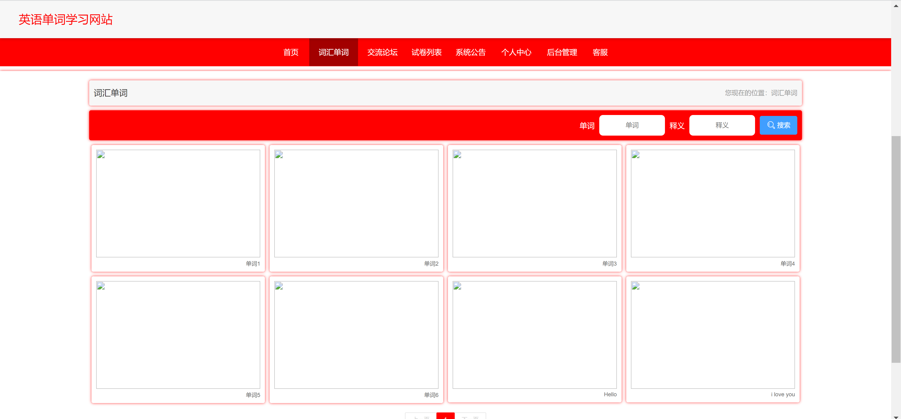
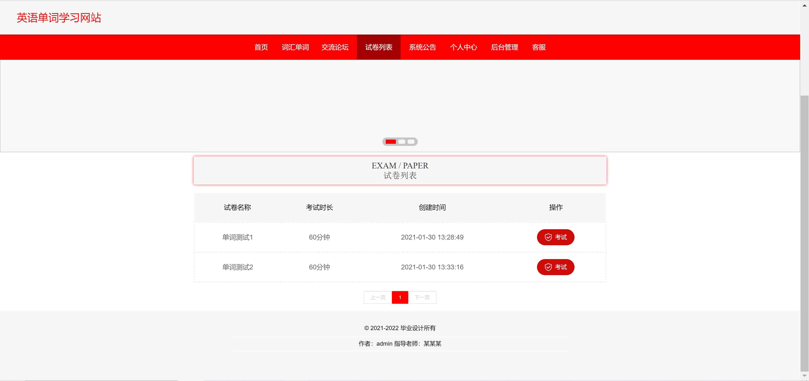
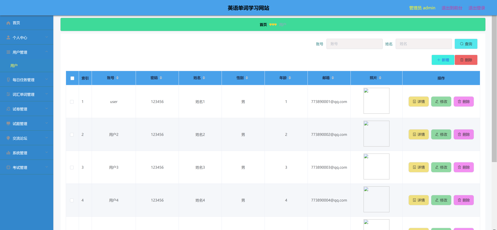
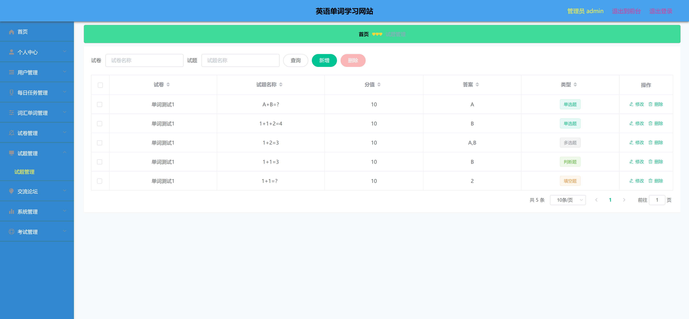
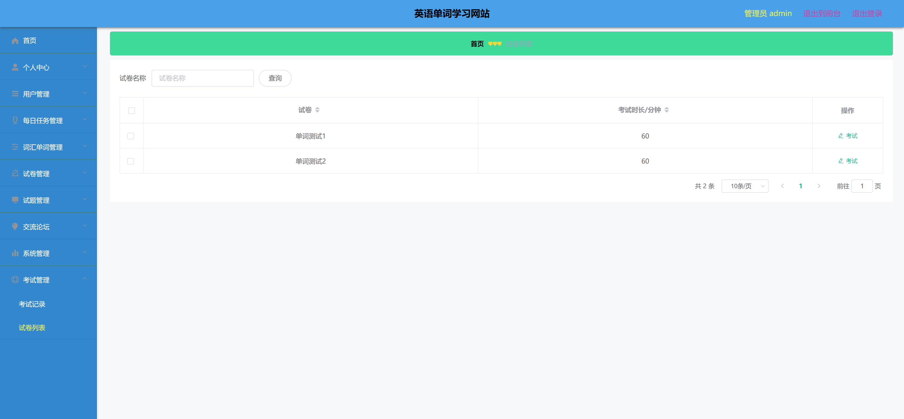

<h1 align="center">英语单词学习管理系统</h1>

## 简介
英语单词学习管理系统：角色分为管理员、用户；功能包括词汇单词管理、试题管理、试卷列表、用户管理、每日任务管理、交流论坛和系统管理，支持高效的单词学习和管理体验。    --计算机毕业设计源码；毕设源码；java毕业设计源码

## 联系方式

<h3 align="center">获取完整代码与数据库文件 + 微信：deepguan QQ: 86050149 QQ群: 783742310</h3>

<h3 align="center">可帮忙远程部署 包运行成功！提供远程部署、修改代码、设计文档指导、代码讲解等服务！</h3>

## 功能介绍（完整见运行截图）
管理员： 基本功能包括登录、注册和退出。管理员可以访问系统的各个模块，包括用户管理、词汇单词管理、每日任务管理、试卷管理、交流论坛和系统公告等。可以新增、修改和删除用户信息和试题，浏览试卷列表并参与考试管理。通过系统管理模块，管理员可进行后台设置和维护，确保系统正常运行。

用户： 用户具备基本的登录、注册和退出功能。登录后可以访问首页、词汇单词、交流论坛、试卷列表和系统公告等模块。用户能够搜索单词查询其释义，参与论坛交流，查看和参与测试。通过个人中心，可以管理个人信息，查看练习和考试记录，以及浏览系统公告以获取最新信息。

## 运行截图

本代码来源于网络,仅供学习参考使用!

